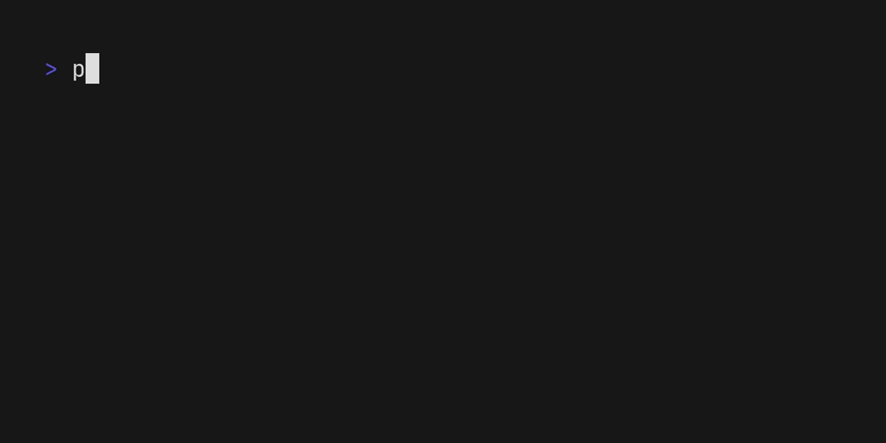

# masstld

masstld is a command line utility that searches for available domain names using a list of TLDs.



## Installing

> [!NOTE]
> There are plans to release masstld to [pypi](https://pypi.org), theese instructions may change heavily in the future

### Requirements

- Python 3.9 or newer
- python3-pip or [Poetry](https://python-poetry.org)

### Installing

1. Clone repository
```sh
git clone https://github.com/ItsNiceCraft/masstld
```
2. Install dependencies
```sh
pip install -r requirements.txt
```
or
```sh
poetry install
```

## Usage

> [!NOTE]
> Detailed documentation for every option is planned

```
usage: masstld.py [-h] [-c COUNT] [-r RESOLVERS] [-l TLD_LIST] [-psl] [--export-markdown EXPORT_MARKDOWN] [--export-json EXPORT_JSON] [-u] domain

positional arguments:
  domain                The domain name to check TLDs for

options:
  -h, --help            show this help message and exit
  -c COUNT, --count COUNT
                        Amount of TLDs to check
  -r RESOLVERS, --resolvers RESOLVERS
                        Specify resolvers to use. Example: -r 1.1.1.1 -r 9.9.9.9
  -l TLD_LIST, --tld-list TLD_LIST
                        URL or path to the custom tld list file. TLDs must be seperated by newlines
  -psl, --use-psl       Use the Public Suffix List as the TLD list. Can't be used when a custom TLD list is used
  --export-markdown EXPORT_MARKDOWN
                        Export results to a specified markdown file
  --export-json EXPORT_JSON
                        Export results to a specified json file
  -u, --upload          Upload the results to rentry.co in markdown format
```